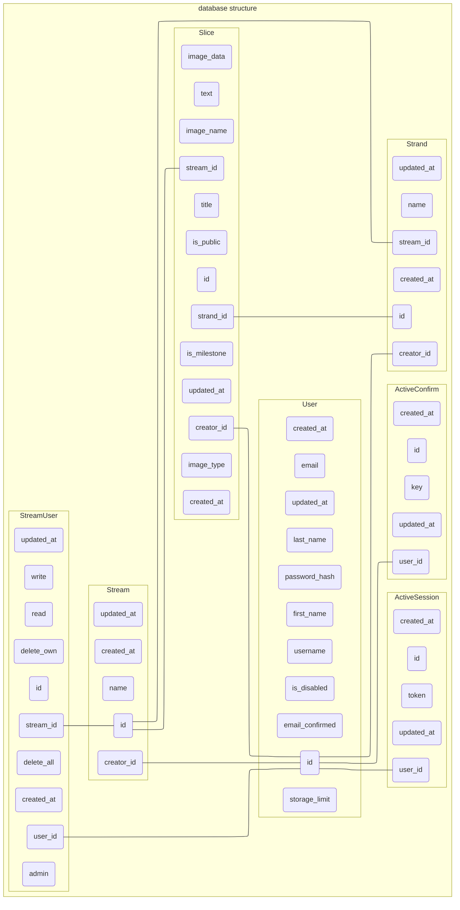

# Database Guide

## Schematic

```mermaid
%%{init: {"flowchart": {"defaultRenderer": "elk"}} }%%
flowchart LR
    subgraph database structure
        subgraph User
            U1(id)
            U2(username)
            U3(first_name)
            U4(last_name)
            U5(email)
            U6(password_hash)
            U7(is_disabled)
            U8(storage_limit)
            U9(email_confirmed)
            U10(created_at)
            U11(updated_at)
        end
        subgraph ActiveSession
            AS1(id)
            AS2(user_id)
            AS3(token)
            AS4(created_at)
            AS5(updated_at)
        end
        subgraph Stream
            S1(id)
            S2(creator_id)
            S3(name)
            S4(created_at)
            S5(updated_at)
        end
        subgraph Strand
            ST1(id)
            ST2(creator_id)
            ST3(stream_id)
            ST4(name)
            ST5(created_at)
            ST6(updated_at)
        end
        subgraph StreamUser
            SU1(id)
            SU2(stream_id)
            SU3(user_id)
            SU4(read)
            SU5(write)
            SU6(delete_own)
            SU7(delete_all)
            SU8(admin)
            SU9(created_at)
            SU10(updated_at)
        end
        subgraph Slice
            SL1(id)
            SL2(creator_id)
            SL3(stream_id)
            SL4(title)
            SL5(text)
            SL6(is_public)
            SL7(is_milestone)
            SL8(created_at)
            SL9(updated_at)
            SL10(image_data)
            SL11(image_name)
            SL12(image_type)
            SL13(strand_id)
        end
        subgraph ActiveConfirm
            AC1(id)
            AC2(user_id)
            AC3(key)
            AC4(created_at)
            AC5(updated_at)
        end
    end
    U1---AS2
    SU3---U1
    S2---U1
    SU2---S1
    S1---SL3
    SL2---U1
    U1---AC2
    U1---ST2
    S1---ST3
    SL13---ST1
```
